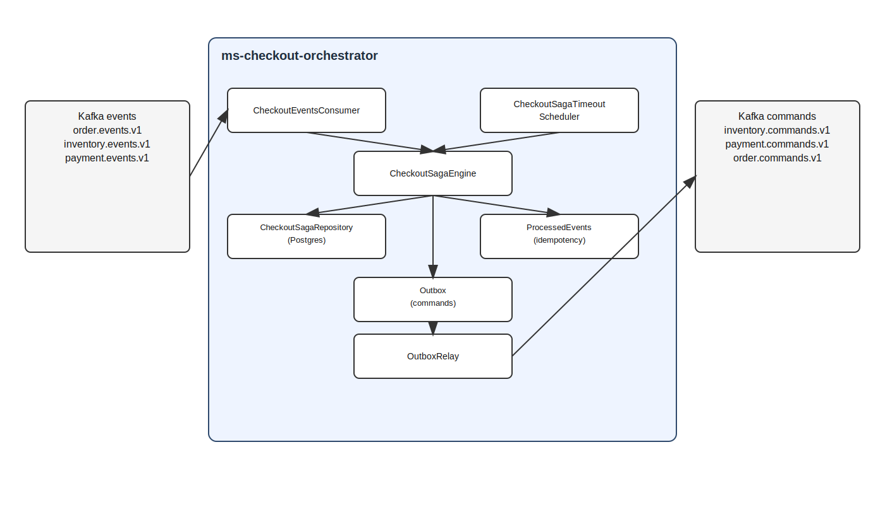
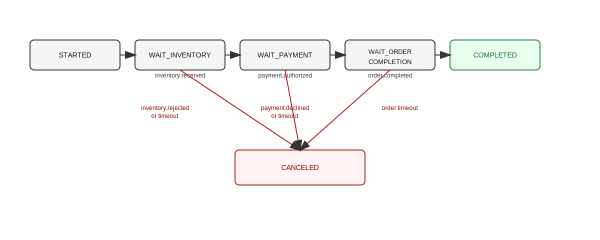
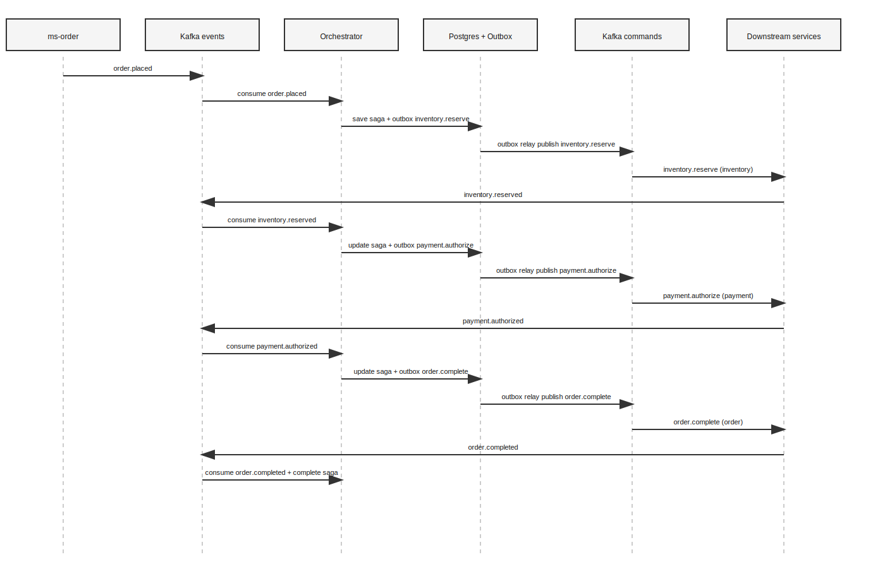
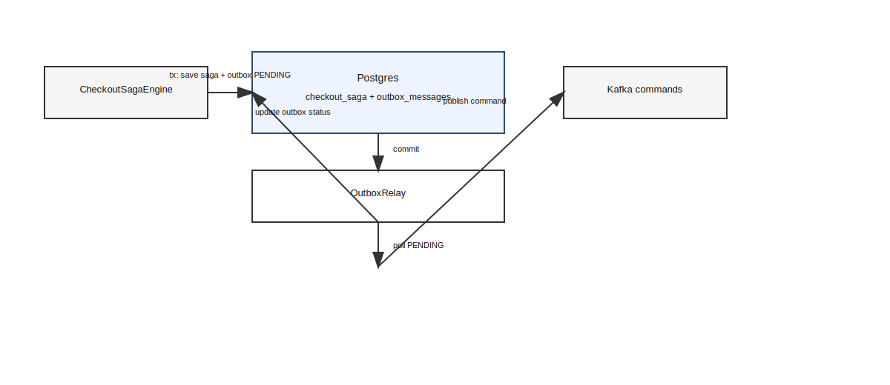
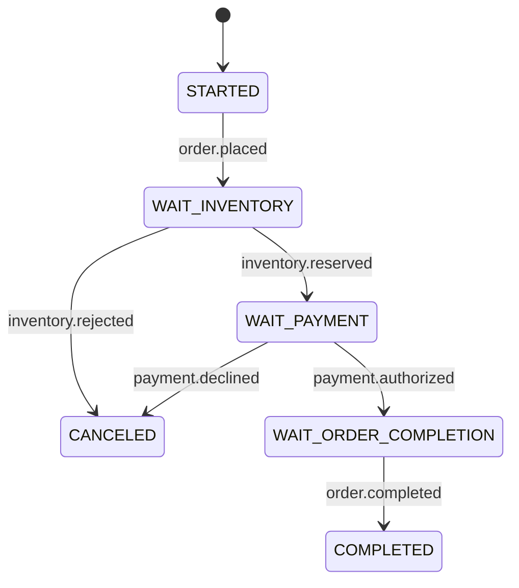
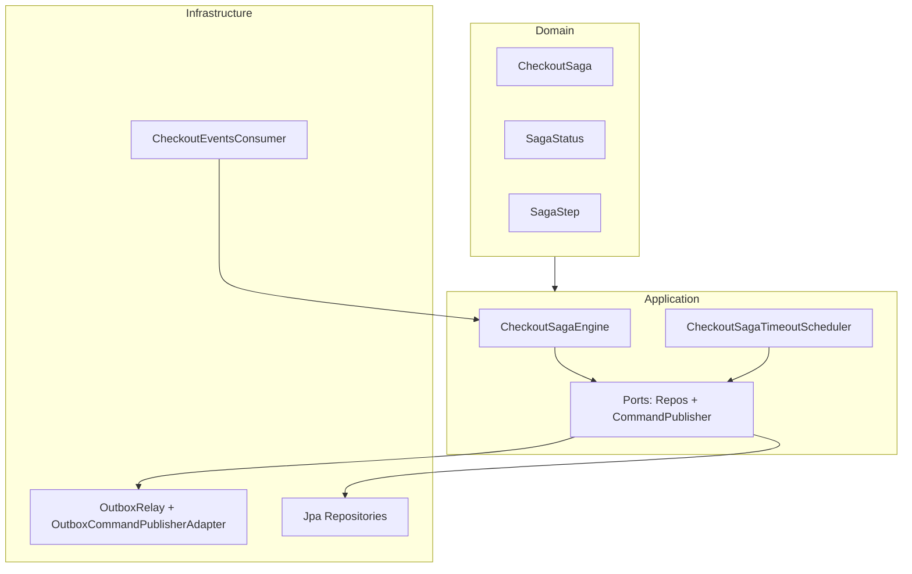

# ms-checkout-orchestrator

Este documento e o onboarding oficial do ms-checkout-orchestrator. Ele foi escrito para pessoas reais que estao chegando agora no time. A ideia e que voce entenda o problema, o fluxo, a arquitetura, os contratos e onde mexer com seguranca.

## Como usar este documento na primeira semana
1) Leia a visao geral e o modelo mental da saga.
2) Entenda o fluxo principal e os fluxos de falha.
3) Leia os contratos de eventos e comandos.
4) Navegue pelas classes principais listadas abaixo.
5) Rode testes unitarios e, se possivel, integracao com Docker.

## Resumo em 90 segundos
- Este microservico orquestra a saga do checkout.
- Ele recebe eventos, grava estado e publica comandos.
- O fluxo e sequencial: estoque antes de pagamento.
- Existe retry e compensacao para falhas e timeouts.
- A publicacao de comandos usa Outbox Pattern.

Se voce memorizar estes 5 pontos, ja consegue conversar sobre o servico com o time.

## Contexto de negocio e problema real
No varejo real, o cliente recebe "pedido recebido" quase imediatamente. Depois disso, estoque e pagamento acontecem de forma assincrona. O orquestrador existe para coordenar esses passos com seguranca, evitando cobranca sem estoque e garantindo recuperacao quando algum microservico oscila.

## O que este microservico e
- Um orquestrador de saga.
- Um controlador de estado do checkout.
- Um produtor de comandos e consumidor de eventos.
- Uma fonte de verdade para o progresso do checkout.

## O que este microservico nao e
- Nao cria pedidos.
- Nao cobra pagamento.
- Nao reserva estoque diretamente.
- Nao expoe endpoints HTTP de negocio.

## Modelo mental
Pense nele como uma maquina de estados. Cada evento recebido faz a saga andar um passo, ou parar com compensacao. A saga nunca bloqueia thread esperando. Ela apenas avanca quando um evento chega ou quando um timeout dispara.

## Com quem conversa
### Entradas (eventos consumidos)
Topicos:
- `order.events.v1`
- `inventory.events.v1`
- `payment.events.v1`

Eventos relevantes:
- `order.placed`
- `inventory.reserved`
- `inventory.rejected`
- `payment.authorized`
- `payment.declined`
- `order.completed`
- `order.canceled`
- `inventory.released`

### Saidas (comandos publicados)
Topicos:
- `inventory.commands.v1`
- `payment.commands.v1`
- `order.commands.v1`

Comandos relevantes:
- `inventory.reserve`
- `inventory.release`
- `payment.authorize`
- `order.complete`
- `order.cancel`

### Context map (simplificado)
```
order.events.v1      inventory.events.v1      payment.events.v1
        \                 |                         /
         \                |                        /
          --> ms-checkout-orchestrator (saga) <----
               |          |          |
               v          v          v
inventory.commands.v1  payment.commands.v1  order.commands.v1
```

## Diagramas oficiais (SVG/PNG)
Se seu viewer nao renderiza SVG, use os PNGs.

Arquitetura (visao macro):
- SVG: `docs/diagrams/checkout-architecture.svg`
- PNG: `docs/diagrams/checkout-architecture.png`



Maquina de estados (visao detalhada):
- SVG: `docs/diagrams/checkout-states.svg`
- PNG: `docs/diagrams/checkout-states.png`



Sequencia detalhada (happy path):
- SVG: `docs/diagrams/checkout-sequence.svg`
- PNG: `docs/diagrams/checkout-sequence.png`



Outbox e relay (transacao e publicacao):
- SVG: `docs/diagrams/outbox-relay.svg`
- PNG: `docs/diagrams/outbox-relay.png`



Retry e timeout (scheduler):
- SVG: `docs/diagrams/retry-timeout.svg`
- PNG: `docs/diagrams/retry-timeout.png`


## Fluxo operacional (happy path)
O fluxo e sequencial, sempre estoque antes de pagamento.

1) Recebe `order.placed`.
2) Cria a saga, step `WAIT_INVENTORY`.
3) Publica `inventory.reserve`.
4) Recebe `inventory.reserved`.
5) Step `WAIT_PAYMENT`.
6) Publica `payment.authorize`.
7) Recebe `payment.authorized`.
8) Step `WAIT_ORDER_COMPLETION`.
9) Publica `order.complete`.
10) Recebe `order.completed`.
11) Finaliza a saga com `COMPLETED`.

## Fluxos de falha e compensacao
### Falha de estoque
- Evento: `inventory.rejected`
- Acao: publicar `order.cancel`
- Resultado: saga `CANCELED`

### Falha de pagamento
- Evento: `payment.declined`
- Acao: publicar `inventory.release` e `order.cancel`
- Resultado: saga `CANCELED`

### Timeouts e retries
Cada step tem deadline. Um job periodico avalia atrasos e decide:
- `WAIT_INVENTORY`: reenvia `inventory.reserve` ate `inventoryMax`, depois cancela com `INVENTORY_TIMEOUT`.
- `WAIT_PAYMENT`: reenvia `payment.authorize` ate `paymentMax`, depois libera estoque e cancela com `PAYMENT_TIMEOUT`.
- `WAIT_ORDER_COMPLETION`: reenvia `order.complete` ate `orderCompleteMax`, depois cancela com `ORDER_TIMEOUT`.

### Eventos fora de ordem
Eventos fora do step esperado sao ignorados com warning. Isso protege o estado da saga.

## Maquina de estados (visao rapida)
Status possiveis:
- `RUNNING`: saga ativa
- `COMPLETED`: finalizada com sucesso
- `CANCELED`: finalizada por falha ou timeout

Steps principais:
- `STARTED` -> `WAIT_INVENTORY` -> `WAIT_PAYMENT` -> `WAIT_ORDER_COMPLETION` -> `DONE`
- `COMPENSATING` aparece nos headers quando estamos enviando comandos de compensacao

### Diagrama ASCII de estados
```
STARTED
  |
  v
WAIT_INVENTORY -- inventory.rejected --> CANCELED/DONE
  |
  | inventory.reserved
  v
WAIT_PAYMENT -- payment.declined --> CANCELED/DONE
  |
  | payment.authorized
  v
WAIT_ORDER_COMPLETION -- order.completed --> COMPLETED/DONE
```

### Diagrama de estados (mermaid)


## Regras de negocio essenciais
- Sequencia obrigatoria: estoque antes de pagamento.
- Kafka key sempre igual a `orderId`.
- Idempotencia por `eventId`.
- Compensacao de pagamento implica liberar estoque.
- `order.placed` deve trazer `items`, `total` e `currency`.
- Se `total/currency` estiverem ausentes, o orquestrador calcula fallback com base nos itens e usa `BRL`, registrando warn.

## Contratos de mensagens

### Exemplo de evento `order.placed`
```json
{
  "eventId": "evt-123",
  "occurredAt": "2025-01-01T10:00:00Z",
  "orderId": "order-1",
  "customerId": "cust-1",
  "items": [
    { "productId": "sku-1", "quantity": 2, "unitPrice": "10.00" },
    { "productId": "sku-2", "quantity": 1, "unitPrice": "5.00" }
  ],
  "total": "22.50",
  "currency": "BRL",
  "discount": "2.50",
  "paymentMethod": "card"
}
```

### Exemplo de comando `inventory.reserve`
```json
{
  "commandId": "cmd-1",
  "occurredAt": "2025-01-01T10:00:01Z",
  "orderId": "order-1",
  "items": [
    { "productId": "sku-1", "quantity": 2 },
    { "productId": "sku-2", "quantity": 1 }
  ]
}
```

### Exemplo de comando `payment.authorize`
```json
{
  "commandId": "cmd-2",
  "occurredAt": "2025-01-01T10:00:05Z",
  "orderId": "order-1",
  "customerId": "cust-1",
  "amount": "22.50",
  "currency": "BRL",
  "paymentMethod": "card"
}
```

### Exemplo de comando `order.cancel`
```json
{
  "commandId": "cmd-3",
  "occurredAt": "2025-01-01T10:02:10Z",
  "orderId": "order-1",
  "reason": "PAYMENT_DECLINED"
}
```

### Headers padrao (comando publicado)
```
x-event-id: <uuid>
x-command-id: <uuid>
x-event-type: inventory.reserve
x-command-type: inventory.reserve
x-occurred-at: 2025-01-01T10:00:01Z
x-correlation-id: <orderId ou correlation da saga>
x-causation-id: <eventId do passo anterior>
x-producer: ms-checkout-orchestrator
x-topic-version: v1
x-schema-version: v1
x-aggregate-type: Order
x-aggregate-id: <orderId>
x-saga-id: <sagaId>
x-saga-name: checkout
x-saga-step: WAIT_INVENTORY
```

## Kafka, topicos e consumer group
- Topicos: `order.events.v1`, `inventory.events.v1`, `payment.events.v1`, `order.commands.v1`, `inventory.commands.v1`, `payment.commands.v1`.
- Consumer group: `ms-checkout-orchestrator`.
- Key obrigatoria: `orderId` (garante ordenacao por pedido).

## Persistencia (Postgres)
Tabelas principais:
- `checkout_saga`:
  - estado atual, step, deadline e tentativas
  - snapshot de itens em `items_json`
- `processed_events`:
  - idempotencia por `event_id`
- `outbox_messages`:
  - comandos pendentes, status e retry

## Arquitetura limpa e hexagonal
Organizacao por camadas:
- Domain: regras de negocio da saga.
- Application: orquestracao e uso das portas.
- Infrastructure: Kafka, JPA e Outbox.

Diagrama simples:
```
Domain <--- Application <--- Infrastructure
   ^             ^                 ^
   |             |                 |
  regras       casos           adaptadores
```

### Diagrama de arquitetura (mermaid)


## DDD aplicado
- `CheckoutSaga` e o agregado principal.
- `SagaStatus` e `SagaStep` formam a linguagem ubiqua.
- Metodos do agregado validam transicoes e preservam invariantes.
- Excecoes de dominio evitam estados invalidos.

## Principais classes operacionais (explicado)
As classes abaixo sao o coracao do fluxo. Leia cada uma com calma.

1) `CheckoutSagaEngine`
- E o cerebro do orquestrador. Ele recebe um evento e decide o proximo comando.
- Ele valida step, aplica idempotencia e grava o estado da saga.

2) `CheckoutSagaTimeoutScheduler`
- Job que varre sagas expiradas e dispara retries ou compensacoes.
- E aqui que os timeouts se transformam em acao real.

3) `CheckoutSagaCommandSender`
- Centraliza criacao de comandos e headers.
- Ajuda a garantir padrao consistente em todas as publicacoes.

4) `CheckoutSaga`
- Agregado de dominio com status, step, deadlines e tentativas.
- Garante transicoes validas e guarda snapshot minimo do pedido.

5) `SagaStatus`
- Estado macro da saga: RUNNING, COMPLETED, CANCELED.
- Facilita leitura de dashboards e consultas.

6) `SagaStep`
- Passo detalhado do fluxo, usado para validar ordem de eventos.
- Ajuda a evitar efeitos duplicados e fora de ordem.

7) `CheckoutSagaItem`
- Snapshot minimo de itens para reenviar `inventory.reserve`.
- Evita dependencia de outros servicos para reprocessar.

8) `CheckoutEventsConsumer`
- Kafka listener de entrada.
- Converte `ConsumerRecord` em `EventEnvelope`.

9) `EventEnvelope`
- Normaliza headers e payload.
- Garante leitura consistente de correlation e causation.

10) `OutboxCommandPublisherAdapter`
- Persiste comandos na tabela outbox.
- Evita publicar direto no Kafka dentro da transacao.

11) `OutboxRelay`
- Le a outbox e publica no Kafka com retry e backoff.
- E o mecanismo de entrega confiavel.

12) `JpaCheckoutSagaRepositoryAdapter`
- Mapeia agregado para JPA.
- Lida com `items_json`, deadlines e tentativas.

13) `JpaProcessedEventRepositoryAdapter`
- Implementa idempotencia com insert unico.
- Se ja existe, ignora o evento.

14) `SagaProperties`
- Centraliza configuracoes de timeout e retries.
- Evita hardcode no codigo.

## Tecnologias envolvidas
- Java 21
- Spring Boot 3
- Spring Kafka
- Spring Data JPA
- Flyway
- PostgreSQL
- Kafka / Redpanda
- Testcontainers (testes de integracao)

## Configuracao principal
Em `application.yaml`:
- `spring.kafka.bootstrap-servers`
- `spring.kafka.consumer.group-id`
- `saga.timeouts.inventorySeconds`
- `saga.timeouts.paymentSeconds`
- `saga.timeouts.orderCompleteSeconds`
- `saga.retries.inventoryMax`
- `saga.retries.paymentMax`
- `saga.retries.orderCompleteMax`
- `outbox.relay.*`

## Runbook operacional (local, staging, prod)

### Local (docker compose + spring boot)
Infra (a partir do repo root):
```
docker compose -f containers/docker-compose.yaml up -d
docker compose -f containers/docker-compose.yaml ps
```

Infra (a partir de `ms-checkout-orchestrator`):
```
docker compose -f ../containers/docker-compose.yaml up -d
docker compose -f ../containers/docker-compose.yaml ps
```

Banco (criar se nao existir, ignore se ja existir):
```
docker exec -it postgres psql -U postgres -d postgres -c "create database \"ms-checkout-orchestrator\";"
```

Subir o servico:
```
./mvnw spring-boot:run
```

Kafka (topicos e consumer group):
```
docker exec -it kafka-1 kafka-topics --bootstrap-server localhost:9092 --list
docker exec -it kafka-1 kafka-consumer-groups --bootstrap-server localhost:9092 --describe --group ms-checkout-orchestrator
```

Banco (inspecao rapida):
```
docker exec -it postgres psql -U postgres -d ms-checkout-orchestrator -c "select status, count(*) from outbox_messages group by status;"
docker exec -it postgres psql -U postgres -d ms-checkout-orchestrator -c "select order_id, status, step, deadline_at from checkout_saga order by updated_at desc limit 20;"
```

### Kubernetes (staging/prod)
Padrao do time:
- Namespace: `retail-store`
- Service: `ms-orchestrator`
- Deployment: `ms-orchestrator`
- Deploy: Helm + kubectl, via GitHub Actions

Contexto e namespace:
```
kubectl config get-contexts
kubectl config use-context <context>
kubectl get ns
```

Descobrir recursos (ajuste o filtro conforme seus labels):
```
kubectl -n retail-store get deploy,po,svc | grep -i orchestrator
kubectl -n retail-store get po -l app=ms-orchestrator -o wide
```

Status do deploy e rollout:
```
kubectl -n retail-store rollout status deploy/ms-orchestrator
kubectl -n retail-store describe deploy ms-orchestrator
```

Eventos recentes do namespace:
```
kubectl -n retail-store get events --sort-by=.lastTimestamp | tail -n 30
```

Logs (tudo e pod especifico):
```
kubectl -n retail-store logs -f deploy/ms-orchestrator --tail=200
kubectl -n retail-store logs -f <pod> --tail=200
kubectl -n retail-store logs --previous <pod> --tail=200
```

Debug dentro do pod:
```
kubectl -n retail-store exec -it <pod> -- /bin/sh
kubectl -n retail-store exec -it <pod> -- printenv | grep -E "KAFKA|DATASOURCE|SAGA"
```

Port-forward (se precisar inspecionar localmente):
```
kubectl -n retail-store port-forward svc/ms-orchestrator 8097:8097
```

Helm (deploys e rollback):
```
helm -n retail-store list
helm -n retail-store history ms-orchestrator
helm -n retail-store upgrade --install ms-orchestrator <chart> -f <values.yaml>
helm -n retail-store rollback ms-orchestrator <revision>
```

GitHub Actions (pista rapida):
- Pipeline deve executar lint/test e depois `helm upgrade`.
- Valide o rollout no cluster apos o merge.

Kafka (topicos e grupo, a partir do host com kafka tools):
```
kafka-topics --bootstrap-server <broker> --describe --topic order.events.v1
kafka-consumer-groups --bootstrap-server <broker> --describe --group ms-checkout-orchestrator
```

Banco (consultas de estado):
```
psql "host=<host> port=5432 dbname=ms-checkout-orchestrator user=<user>" -c "select status, count(*) from outbox_messages group by status;"
psql "host=<host> port=5432 dbname=ms-checkout-orchestrator user=<user>" -c "select order_id, status, step, deadline_at from checkout_saga order by updated_at desc limit 20;"
```

Observabilidade (OpenTelemetry + Prometheus + Grafana):
- Tracing: use `correlationId` e `orderId` como chaves principais.
- Metrics: verifique dashboards de Kafka lag, retries e backlog de outbox.
- Logs: priorize `orderId`, `sagaId`, `step` e `eventId` nos filtros.

### Operacoes que mudam estado (somente com aprovacao)
```
kubectl -n retail-store rollout restart deploy/ms-orchestrator
kubectl -n retail-store rollout undo deploy/ms-orchestrator
kubectl -n retail-store scale deploy/ms-orchestrator --replicas=2
```

## Testes
Unitarios:
```
./mvnw test
```

Integracao (Testcontainers):
```
./mvnw -Dtest=CheckoutOrchestratorIntegrationTest test
```

## Troubleshooting (com exemplos reais)

### Integracao pulando testes (Testcontainers)
Log:
```
Could not find a valid Docker environment
client version 1.32 is too old. Minimum supported API version is 1.44
```
Solucao:
- Execute com `DOCKER_API_VERSION=1.44` ou atualize o Docker.

### Permissao negada no Docker
Log:
```
permission denied while trying to connect to the docker API
```
Solucao:
- Rodar os testes com usuario que tenha acesso ao socket do Docker.

### Eventos sem headers obrigatorios
Log:
```
Ignoring message without x-event-type
Ignoring message without x-event-id
```
Solucao:
- Garanta que o produtor envia `x-event-id` e `x-event-type`.

### Outbox acumulando mensagens
Sinal:
- `outbox_messages` com status `FAILED` ou `PENDING` por muito tempo.
Solucao:
- Verifique conexao Kafka, bootstrap-servers e logs do `OutboxRelay`.

### Evento fora de ordem
Log:
```
Out-of-order event=payment.authorized orderId=... step=WAIT_INVENTORY
```
Solucao:
- Corrija o fluxo upstream para respeitar a sequencia.

## Exemplos de logs (correlation e causation)
### Happy path
```
INFO  CheckoutSagaEngine - order.placed received orderId=order-1 eventId=evt-1 corr=order-1
INFO  OutboxRelay - published inventory.reserve orderId=order-1 commandId=cmd-1 cause=evt-1 corr=order-1
INFO  CheckoutSagaEngine - inventory.reserved received orderId=order-1 eventId=evt-2 corr=order-1
INFO  OutboxRelay - published payment.authorize orderId=order-1 commandId=cmd-2 cause=evt-2 corr=order-1
INFO  CheckoutSagaEngine - payment.authorized received orderId=order-1 eventId=evt-3 corr=order-1
INFO  OutboxRelay - published order.complete orderId=order-1 commandId=cmd-3 cause=evt-3 corr=order-1
INFO  CheckoutSagaEngine - order.completed received orderId=order-1 eventId=evt-4 corr=order-1
INFO  CheckoutSagaEngine - saga completed orderId=order-1 sagaId=saga-1
```

### Falha de pagamento com compensacao
```
INFO  CheckoutSagaEngine - payment.declined received orderId=order-9 eventId=evt-9 corr=order-9
INFO  OutboxRelay - published inventory.release orderId=order-9 commandId=cmd-10 cause=evt-9 corr=order-9
INFO  OutboxRelay - published order.cancel orderId=order-9 commandId=cmd-11 cause=evt-9 corr=order-9
WARN  CheckoutSagaEngine - saga canceled orderId=order-9 reason=PAYMENT_DECLINED
```

### Timeout de estoque
```
INFO  CheckoutSagaTimeoutScheduler - due sagas: 1
INFO  CheckoutSagaTimeoutScheduler - retry inventory.reserve orderId=order-7 attempt=1
INFO  OutboxRelay - published inventory.reserve orderId=order-7 commandId=cmd-21 cause=saga-7 corr=order-7
WARN  CheckoutSagaTimeoutScheduler - inventory timeout orderId=order-7 attempts=2
INFO  OutboxRelay - published order.cancel orderId=order-7 commandId=cmd-22 cause=saga-7 corr=order-7
```

## Guia de depuracao ponta a ponta
1) Descubra o `orderId` (key do Kafka).
2) Verifique o estado atual da saga:
```
SELECT order_id, status, step, deadline_at, attempts_inventory, attempts_payment, last_error
FROM checkout_saga
WHERE order_id = 'order-1';
```
3) Verifique se o evento foi processado:
```
SELECT event_id, event_type, processed_at
FROM processed_events
WHERE order_id = 'order-1'
ORDER BY processed_at ASC;
```
4) Verifique se o comando foi publicado:
```
SELECT event_id, event_type, status, retry_count, last_error
FROM outbox_messages
WHERE aggregate_id = 'order-1'
ORDER BY created_at ASC;
```
5) Se a saga estiver travada:
- Veja `deadline_at` e `attempts_*`.
- Verifique logs do `CheckoutSagaTimeoutScheduler`.

## Simulacao do fluxo com Redpanda Console
1) Publique `order.placed` em `order.events.v1` com headers corretos.
2) Verifique `inventory.reserve` em `inventory.commands.v1`.
3) Publique `inventory.reserved`.
4) Verifique `payment.authorize`.
5) Publique `payment.authorized`.
6) Verifique `order.complete`.
7) Publique `order.completed`.
8) Consulte `checkout_saga` para confirmar `COMPLETED`.

### Exemplo de headers no Redpanda Console
```
x-event-id: evt-1
x-event-type: order.placed
x-occurred-at: 2025-01-01T10:00:00Z
x-correlation-id: order-1
x-causation-id: evt-1
x-aggregate-type: Order
x-aggregate-id: order-1
x-producer: manual-test
x-topic-version: v1
x-schema-version: v1
```

## Tabela de expectativa (evento -> comando -> proximo step)
```
Evento recebido           Comando publicado                 Proximo step
----------------------    -------------------------------   -------------------------
order.placed              inventory.reserve                 WAIT_INVENTORY
inventory.reserved        payment.authorize                 WAIT_PAYMENT
payment.authorized        order.complete                    WAIT_ORDER_COMPLETION
order.completed           (nenhum)                          DONE + status COMPLETED

inventory.rejected        order.cancel                      DONE + status CANCELED
payment.declined          inventory.release + order.cancel  DONE + status CANCELED
```

## Checklist de validacao para releases
1) Contratos
- `order.placed` contem `items`, `total`, `currency`.
- `inventory.reserve` usa `items` com `productId` e `quantity`.
- `payment.authorize` contem `amount`, `currency` e `paymentMethod`.

2) Idempotencia
- `processed_events` com PK em `event_id` esta ativo.
- Eventos duplicados nao geram comandos duplicados.

3) Outbox
- `outbox_messages` sem backlog antigo em `PENDING` ou `FAILED`.
- `OutboxRelay` ativo e logando publicacao.

4) Timeouts
- `saga.timeouts.*` com valores coerentes para o ambiente.
- `saga.retries.*` definidos e revisados.

5) Kafka
- Topicos criados em `v1` e com partitions esperadas.
- Consumer group `ms-checkout-orchestrator` ativo.

6) Observabilidade
- Logs com correlation/causation presentes.
- Warnings de eventos fora de ordem sendo analisados.

7) Testes
- `./mvnw test` executado.
- Integracao com Testcontainers executada quando Docker estiver disponivel.

## FAQ rapido
Q: Por que o orquestrador nao chama estoque e pagamento em paralelo?
A: Porque estoque e interno e barato de compensar, pagamento e externo e caro de reverter. O fluxo sequencial reduz custo e risco.

Q: Por que existe outbox se ja temos Kafka?
A: Para garantir consistencia. O outbox grava o comando na mesma transacao da saga, evitando perda em falhas.

Q: Por que eventos fora de ordem sao ignorados?
A: Para proteger o estado da saga. Um evento fora do step esperado pode gerar efeitos incorretos.

Q: O que acontece se `order.placed` nao tiver `total`?
A: O orquestrador calcula a soma com base nos itens e registra um warn. Isso e fallback, nao e o ideal.

Q: Posso mudar o tempo de timeout?
A: Sim. Ajuste `saga.timeouts.*` no `application.yaml`.

Q: Como sei se um pedido esta travado?
A: Consulte `checkout_saga` e veja `status`, `step`, `deadline_at` e `attempts_*`.

## Mapa de pastas e por que existe
```
src/main/java/com/mvbr/retailstore/checkout
  config/
    SagaProperties                 -> Config de timeouts e retries
  domain/
    exception/                     -> Excecoes de dominio
    model/                         -> Agregado da saga e enums
  application/
    port/out/                      -> Portas para persistencia e publicacao
    service/                       -> Regras do fluxo e scheduler
  infrastructure/
    adapter/in/messaging/          -> Kafka listeners e envelope
    adapter/out/messaging/         -> DTOs, headers e outbox
    adapter/out/persistence/       -> JPA entities e repos
```

## Walkthrough guiado (15 minutos)
0-2 min: Entenda o problema
- O cliente cria um pedido e recebe resposta rapida.
- Estoque e pagamento sao assincronos.
- O orquestrador controla ordem e compensacoes.

2-5 min: Leia o fluxo no codigo
- Abra `CheckoutSagaEngine` e siga o metodo `handle`.
- Veja como cada `eventType` chama um metodo especifico.

5-8 min: Entenda a persistencia
- Abra `CheckoutSaga` e `CheckoutSagaJpaEntity`.
- Veja as colunas de deadline e tentativas.

8-10 min: Veja como comandos sao publicados
- Abra `CheckoutSagaCommandSender`.
- Abra `OutboxCommandPublisherAdapter` e `OutboxRelay`.

10-12 min: Veja como o timeout funciona
- Abra `CheckoutSagaTimeoutScheduler`.

12-15 min: Rode os testes
- `./mvnw test`.

Se voce consegue explicar o fluxo para outra pessoa, o onboarding tecnico esta completo.

## Primeiro PR (tarefas seguras e guiadas)
Escolha uma das opcoes abaixo. Todas sao pequenas e reversiveis.

1) Teste de evento fora de ordem.
Arquivo: `src/test/java/com/mvbr/retailstore/checkout/application/service/CheckoutSagaEngineTest.java`.
Objetivo: garantir que `payment.authorized` antes de `inventory.reserved` nao avanca step e nao publica comando.
Validacao: `./mvnw test`.

2) Teste de timeout maximo (pagamento).
Arquivo: `src/test/java/com/mvbr/retailstore/checkout/application/service/CheckoutSagaTimeoutSchedulerTest.java`.
Objetivo: ao exceder `paymentMax`, cancelar e publicar `inventory.release` + `order.cancel`.
Validacao: `./mvnw test`.

3) Teste de fallback de `total` e `currency`.
Arquivo: `src/test/java/com/mvbr/retailstore/checkout/application/service/CheckoutSagaEngineTest.java`.
Objetivo: quando `order.placed` vem sem `total` ou `currency`, o engine calcula total e usa `BRL`.
Validacao: `./mvnw test`.

4) Documentar comando `inventory.release`.
Arquivo: `README.md`.
Objetivo: incluir exemplo JSON e explicar o campo `reservationId`.
Validacao: revisao manual.

5) Log de idempotencia mais claro.
Arquivo: `src/main/java/com/mvbr/retailstore/checkout/infrastructure/adapter/out/persistence/JpaProcessedEventRepositoryAdapter.java`.
Objetivo: adicionar log debug quando o evento ja foi processado.
Validacao: `./mvnw test`.

## Primeiras tarefas sugeridas (dia 2-3)
1) Ajuste timeouts no `application.yaml` e rode testes.
2) Simule um checkout no Redpanda Console.
3) Force uma falha de pagamento e observe compensacao.
4) Consulte `checkout_saga` e confirme `status` e `step`.
5) Publique evento duplicado e confirme idempotencia.
6) Pare o Kafka e veja outbox acumular, depois volte e observe o relay.
7) Acompanhe logs por `orderId`.

## Roadmap tecnico curto
Curto prazo:
- Garantir eventos consistentes de inventory e payment.
- Ajustar `paymentMethod` e `reservationId` quando esses servicos estiverem prontos.
- Reforcar logs com campos estruturados.

Medio prazo:
- Captura de pagamento mais tarde (ex: no shipping).
- Metricas de tempo por step.
- Tracing distribuido com traceparent.

Longo prazo:
- Fluxos paralelos para itens digitais.
- Reprocessamento manual de sagas travadas.
- Dashboards de SLA de checkout.

## Padroes de commit e logging
### Commits
- `feat(checkout): ...`
- `fix(checkout): ...`
- `docs(checkout): ...`
- `test(checkout): ...`

### Logging
- Inclua `orderId`, `sagaId` e `step` sempre que possivel.
- Nao logue dados sensiveis de pagamento.

## Glossario rapido
- Event: fato ocorrido e publicado.
- Command: pedido para executar uma acao.
- Correlation ID: id unico para rastrear todo o checkout.
- Causation ID: id da mensagem que causou o comando atual.
- Outbox: tabela que guarda comandos antes de publicar.
- Deadline: limite de tempo de um step da saga.

## Referencias internas
- Documento de tarefa: `artifacts/tasks/02-checkout-pipeline-orquestration.md`
